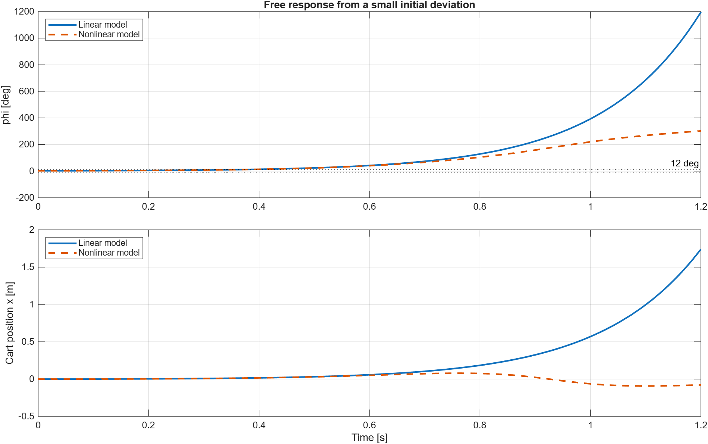
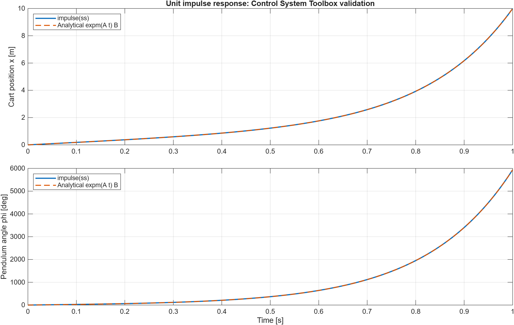
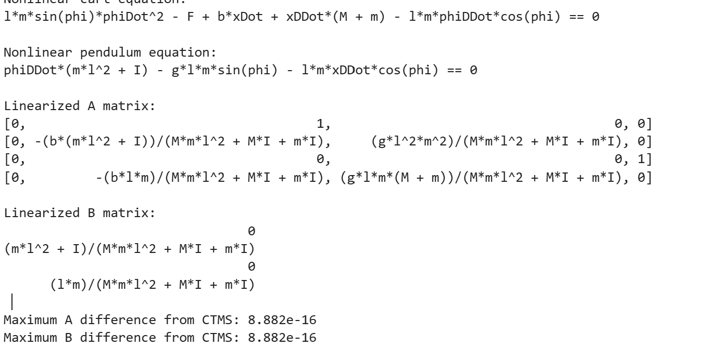

# Домашня робота №2

**Дисципліна:** Інженерія польоту  
**Тема:** Обернений маятник, повороти в NED і символьне виведення рівнянь  
**Виконали:** Dmytro Povolotskyi, Ievgen Bovkun  
**Дата:** 27.07.2026

## Вступ

У роботі досліджено нестійку систему «обернений маятник на візку»,
послідовність поворотів між навігаційною NED та зв'язаною системами
координат, а також символьне виведення рівнянь маятника в MATLAB.
MATLAB-файли й результати розміщені у репозиторії:
<https://github.com/ievgen-bovkun/flight-engineering-RD>.

## 1. Обернений маятник на візку

### 1.1. Вихідні дані

Параметри взято з прикладу CTMS: маса візка `M = 0.5 kg`, маса
маятника `m = 0.2 kg`, коефіцієнт тертя `b = 0.1 N s/m`, відстань до
центра мас `l = 0.3 m`, момент інерції `I = 0.006 kg m^2`,
прискорення вільного падіння `g = 9.8 m/s^2`.

Вектор стану:

$$
X = [x,\ \dot{x},\ \varphi,\ \dot{\varphi}]^T,
$$

де `x` - координата візка, а `phi` - кут маятника від верхнього
вертикального положення.

### 1.2. Нелінійні та лінеаризовані рівняння

Повна нелінійна модель:

$$
(M+m)\ddot{x} + b\dot{x} - ml\ddot{\varphi}\cos\varphi
 + ml\dot{\varphi}^{2}\sin\varphi = F,
$$

$$
(I+ml^2)\ddot{\varphi} - ml\ddot{x}\cos\varphi
 - mgl\sin\varphi = 0.
$$

Біля верхньої точки рівноваги використано наближення
`sin(phi) ≈ phi`, `cos(phi) ≈ 1`. Отримуємо лінійну модель:

$$
\dot{X} = AX + BF, \qquad y = CX + DF.
$$

Аналітичний розв'язок для початкового стану `X(0)` і входу `F(t)`:

$$
X(t) = e^{At}X(0) + \int_0^t e^{A(t-\tau)}B F(\tau)\,d\tau.
$$

### 1.3. Порівняння методів

Для малого ступінчастого входу `F = 0.01 N` у момент `0.5 s` порівняно
аналітичний розв'язок через матричну експоненту, власний інтегратор RK4
і Simulink-модель.

Максимальні абсолютні розбіжності:

| Порівняння | Похибка |
|---|---:|
| Аналітичний розв'язок - RK4 | `1.313e-10` |
| Аналітичний розв'язок - Simulink | `2.747e-08` |
| RK4 - Simulink | `2.760e-08` |

Криві практично накладаються, тому три незалежні реалізації узгоджені.

### 1.4. Межа застосовності лінеаризації

Для початкового відхилення `phi(0) = 3 deg` порівняно лінійну модель і
повні нелінійні рівняння, інтегровані `ode45`.

На початку траєкторії близькі. Після виходу за орієнтовну межу
`|phi| = 12 deg` лінійна модель починає помітно завищувати зростання,
тому для великих кутів слід використовувати повну нелінійну модель.

### 1.5. Перевірка через Control System Toolbox

Для матриць `A`, `B`, `C`, `D` створено модель `ss(A,B,C,D)` і отримано
імпульсну реакцію командою `impulse`. Її порівняно з аналітичною
формулою `C exp(A t) B`.

Максимальна різниця становить `2.132e-12`. Різке зростання реакції
фізично очікуване: маятник розглядається без регулятора, тому верхня
точка рівноваги нестійка.

## 2. Повороти у NED системі координат

NED означає North-East-Down: вісь `x_N` спрямована на північ, `y_E` -
на схід, `z_D` - вниз. Використано стандартну авіаційну послідовність
поворотів `Z-Y-X`:

$$
R = R_z(\psi)R_y(\theta)R_x(\varphi),
$$

де `psi` - рискання (yaw), `theta` - тангаж (pitch), `phi` - крен
(roll). Для ілюстрації обрано `psi = 45 deg`, `theta = 20 deg`,
`phi = 30 deg`.

### 2.1. Загальна послідовність

Чорний колір показує початкову NED-систему, синій - стан після yaw,
зелений - після pitch, червоний - фінальну body-систему після roll.
Дуги позначають відповідні кути повороту.

### 2.2. Покрокове представлення

У кожній панелі бліді стрілки означають орієнтацію до поточного кроку,
а насичені - після нього. Це дозволяє одночасно бачити загальний перехід
NED → body та прочитати кожен поворот окремо.

## 3. Символьне виведення рівнянь руху

Скрипт MATLAB `run_task3_symbolic_pendulum` відтворює нелінійні рівняння
та символьно лінеаризує їх у верхній точці рівноваги. У результаті
одержано матриці:

$$
A = \begin{bmatrix}
0 & 1 & 0 & 0 \\
0 & -\frac{b(ml^2+I)}{Mml^2+MI+mI} & \frac{gl^2m^2}{Mml^2+MI+mI} & 0 \\
0 & 0 & 0 & 1 \\
0 & -\frac{blm}{Mml^2+MI+mI} & \frac{glm(M+m)}{Mml^2+MI+mI} & 0
\end{bmatrix},
$$

$$
B = \begin{bmatrix}
0 \\
\frac{ml^2+I}{Mml^2+MI+mI} \\
0 \\
\frac{lm}{Mml^2+MI+mI}
\end{bmatrix}.
$$

Порівняння з матрицями CTMS дало максимальну похибку `8.882e-16` для
обох матриць `A` і `B`, тобто вирази збігаються до машинної точності.

## Висновки

1. Лінійна модель, RK4 і Simulink відтворюють однакову динаміку у малому
діапазоні відхилень.
2. Нелінійна модель потрібна, коли кут маятника виходить за межі
лініаризації.
3. `Control System Toolbox` незалежно підтвердив аналітичний розв'язок.
4. Матриця NED-повороту реалізована в послідовності `Z-Y-X` і перевірена
на ортогональність.
5. Символьне виведення у MATLAB підтвердило матриці CTMS до машинної
точності.

## Джерела

1. [CTMS: Inverted Pendulum - System Modeling](https://ctms.engin.umich.edu/CTMS/index.php?example=InvertedPendulum&section=SystemModeling)
2. [Cureus: Modeling and Balancing Control of Inverted Pendulum](https://www.cureusjournals.com/articles/8517-modeling-and-balancing-control-of-inverted-pendulum)
3. [Відеоматеріал з моделювання оберненого маятника](https://www.youtube.com/watch?v=fi54Hz5TiWI&t=252s)
4. Конспект заняття 5, наданий викладачем.
