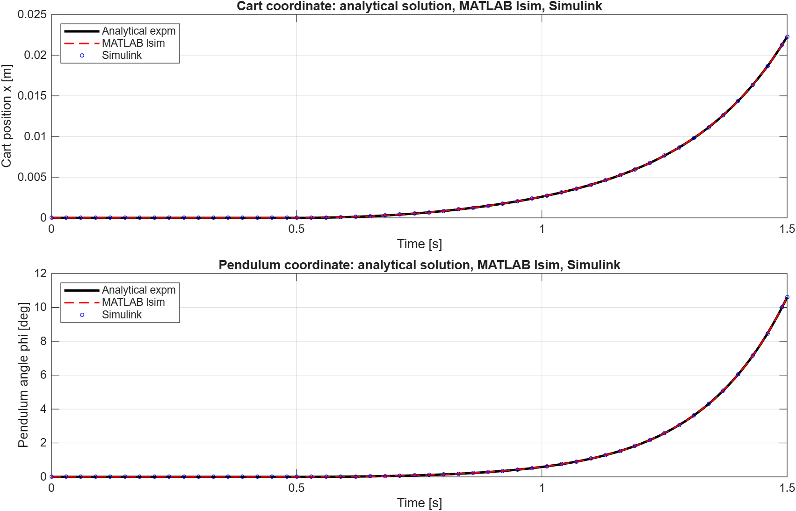

# ДЗ 2. Задача 1: Обернений маятник на візку

**Дисципліна:** Інженерія польоту  
**Виконали:** Dmytro Povolotskyi, Ievgen Bovkun

## 1. Мета

Побудувати лінеаризовану модель оберненого маятника на візку за даними CTMS, отримати її аналітичний розв'язок у просторі станів, реалізувати модель у MATLAB та Simulink і порівняти результати для одного тестового входу.

## 2. Параметри CTMS

| Параметр | Значення |
|---|---:|
| Маса візка `M` | 0.5 kg |
| Маса маятника `m` | 0.2 kg |
| В'язке тертя `b` | 0.1 N s/m |
| Момент інерції `I` | 0.006 kg m^2 |
| Відстань до центра мас `l` | 0.3 m |
| Прискорення вільного падіння `g` | 9.8 m/s^2 |

Стан системи:

```text
X = [x, x_dot, phi, phi_dot]^T,
```

де `x` - координата візка, `phi` - кут маятника від вертикального положення, `F` - горизонтальна сила на візок.

## 3. Диференціальні рівняння

Для обраного напряму кута `phi` нелінійні рівняння мають вигляд:

```math
(M+m)x_ddot + b x_dot - m l phi_ddot cos(phi)
    + m l phi_dot^2 sin(phi) = F,
```

```math
(I + m l^2)phi_ddot - m l x_ddot cos(phi) - m g l sin(phi) = 0.
```

Знакова домовленість для `phi` вибрана так, щоб її лінеаризовані матриці збігалися з моделлю CTMS. Якщо в джерелі кут визначено у протилежному напрямі, перехід виконується заміною `phi -> -phi`.

Біля верхнього положення використовуємо `sin(phi) ~= phi`, `cos(phi) ~= 1` та нехтуємо добутками малих величин. Отримуємо:

```math
(M+m)x_ddot + b x_dot - m l phi_ddot = F,
```

```math
(I + m l^2)phi_ddot - m l x_ddot - m g l phi = 0.
```

Скрипт [derive_pendulum_model.m](../inverted_pendulum/derive_pendulum_model.m) символічно розв'язує рівняння відносно `x_ddot` і `phi_ddot`, а також формує матриці `A` і `B`. Автоматична перевірка підтвердила, що вони збігаються з числовими матрицями CTMS.

## 4. Аналітичний розв'язок

Лінеаризовану систему записано у просторі станів:

```math
X_dot = A X + B F,  y = C X + D F.
```

Її аналітичний розв'язок:

```math
X(t) = exp(A t) X(0) + integral_0^t exp(A(t-tau)) B F(tau) d tau.
```

У [pendulum_analytic_solution.m](../inverted_pendulum/pendulum_analytic_solution.m) інтеграл обчислюється точно для кожного інтервалу з нульовим утриманням входу за допомогою розширеної матричної експоненти.

## 5. Умови експерименту

Для чесної перевірки лінеаризованої моделі використано малий ступінчастий вхід:

| Величина | Значення |
|---|---:|
| Амплітуда сили | `0.01 N` |
| Момент подачі | `0.5 s` |
| Тривалість моделювання | `1.5 s` |
| Початковий стан | `X(0) = 0` |

Виконано три обчислення з ідентичними параметрами:

1. Аналітичний розв'язок через `expm(A*t)`.
2. MATLAB `lsim` для State-Space моделі.
3. Simulink-схема `Step -> State-Space -> Scope / To Workspace`.

## 6. Результати та порівняння



| Порівнювані методи | Максимальна абсолютна похибка |
|---|---:|
| Аналітичний розв'язок - MATLAB `lsim` | `2.776e-16` |
| Аналітичний розв'язок - Simulink | `2.747e-08` |
| MATLAB `lsim` - Simulink | `2.747e-08` |

Криві практично накладаються. Невелика відмінність Simulink пояснюється чисельним інтегратором `ode45` та його допусками.

Відкрита система нестійка: після ступінчастого впливу кут і зміщення починають зростати. Це очікувано для оберненого маятника без регулятора. Тому у валідаційному експерименті обрано короткий часовий інтервал і малу силу; за великих кутів лінеаризована модель втрачає фізичну точність.

## 7. Як запустити

1. Відкрити `homework2/run_homework2.m` у MATLAB.
2. Натиснути зелений **Run**.
3. Відкриється графік порівняння, а файл збережеться як `inverted_pendulum/assets/task1_method_comparison.png`.

Для окремого перегляду Simulink-схеми запустити в Command Window:

```matlab
run_pendulum_simulink
```

## 8. Джерела

- [CTMS: Inverted Pendulum - System Modeling](https://ctms.engin.umich.edu/CTMS/index.php?example=InvertedPendulum&section=SystemModeling)
- [CTMS: Inverted Pendulum - Simulink Modeling](https://ctms.engin.umich.edu/CTMS/index.php/Content/Animations/Content/Activities/Content/Extras/InvertedPendulum/Simulink/Modeling/Basics/?example=InvertedPendulum&section=SimulinkModeling)
- [Cureus: Modeling and Balancing Control of Inverted Pendulum](https://www.cureusjournals.com/articles/8517-modeling-and-balancing-control-of-inverted-pendulum)
- [Додатковий відеоприклад](https://www.youtube.com/watch?v=fi54Hz5TiWI&t=252s)
