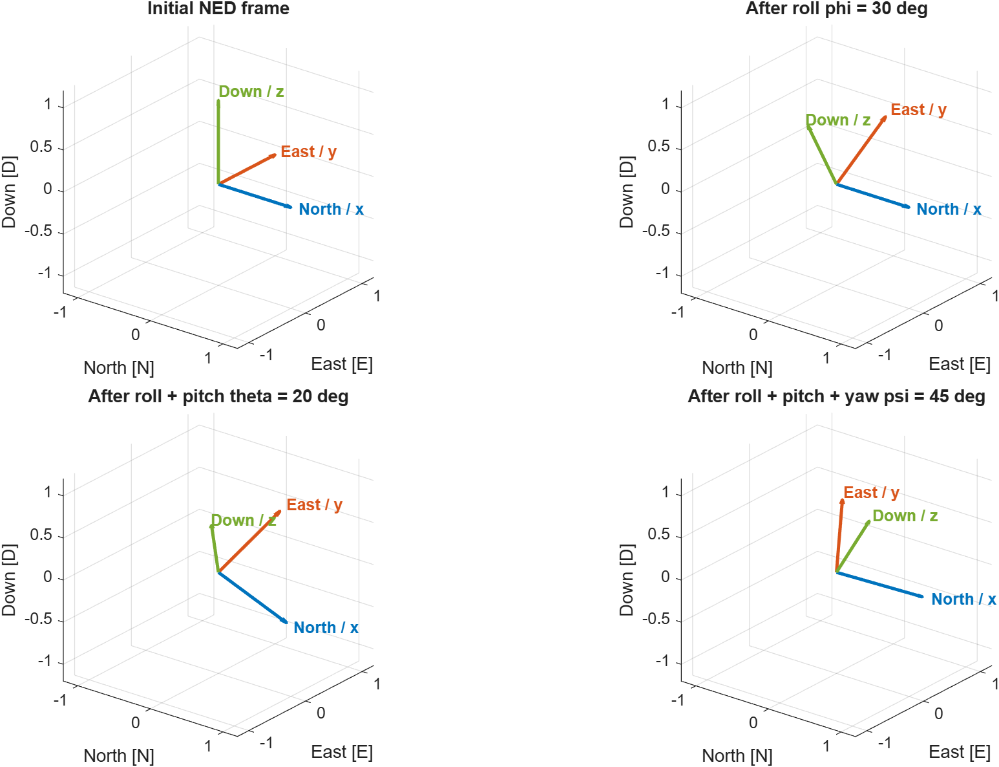
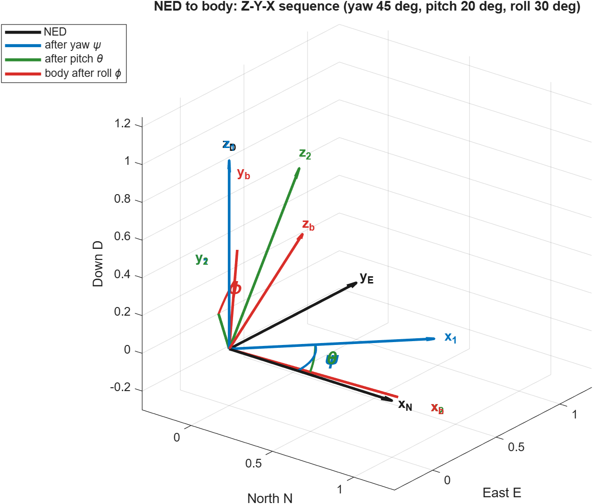
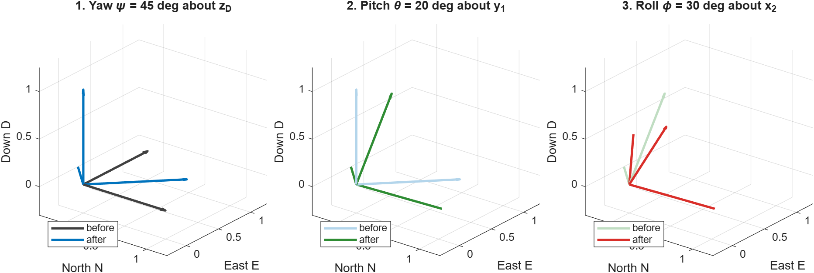

# ДЗ 2. Задача 2: Послідовні повороти в NED

## 1. Система координат

Використано систему **NED** (North-East-Down):

- `x` - North (північ);
- `y` - East (схід);
- `z` - Down (вниз).

Для прикладу обрано кути `phi = 30 deg`, `theta = 20 deg`, `psi = 45 deg`.

## 2. Матриці поворотів

Поворот roll навколо осі `x`:

```math
R_x(phi) = [1 0 0; 0 cos(phi) -sin(phi); 0 sin(phi) cos(phi)].
```

Поворот pitch навколо осі `y`:

```math
R_y(theta) = [cos(theta) 0 sin(theta); 0 1 0; -sin(theta) 0 cos(theta)].
```

Поворот yaw навколо осі `z`:

```math
R_z(psi) = [cos(psi) -sin(psi) 0; sin(psi) cos(psi) 0; 0 0 1].
```

Застосовано послідовність 3-2-1:

```math
R = R_z(psi) R_y(theta) R_x(phi).
```

## 3. Результат



На одному рисунку показано вихідну NED-систему та її орієнтації після кожного кроку:

1. Початкова система: осі спрямовані North, East, Down.
2. Після roll змінюється орієнтація осей East і Down навколо North.
3. Після pitch змінюється орієнтація навколо проміжної осі East.
4. Після yaw виконується фінальний поворот навколо осі Down.

Синя стрілка відповідає North/x, помаранчева - East/y, зелена - Down/z.

## 4. Запуск

Відкрити `homework2/run_task2_ned_rotations.m` у MATLAB та натиснути зелений **Run**. PNG також зберігається як `ned_rotations/assets/ned_roll_pitch_yaw.png`.

## 5. Покращена спільна візуалізація



На одному 3D-рисунку показано початкову NED-систему та проміжні системи
координат. Використано стандартну авіаційну послідовність `Z-Y-X`:

1. рискання `psi` навколо осі Down;
2. тангаж `theta` навколо проміжної осі `y_1`;
3. крен `phi` навколо проміжної осі `x_2`.

Чорний колір відповідає початковій NED, синій — системі після yaw, зелений
— після pitch, червоний — фінальній зв'язаній body-системі. Дуги на рисунку
позначають кути повороту. Фінальна матриця залишається
`R = R_z(psi) R_y(theta) R_x(phi)`; ортогональність матриці перевіряється
автоматичним тестом.

## 6. Покрокове представлення



Другий рисунок показує ті самі три повороти окремо. Світлі стрілки —
орієнтація до поточного кроку, насичені стрілки — орієнтація після нього.
Разом два рисунки дають і загальне уявлення про перехід NED → body, і
можливість детально прочитати кожен поворот.
