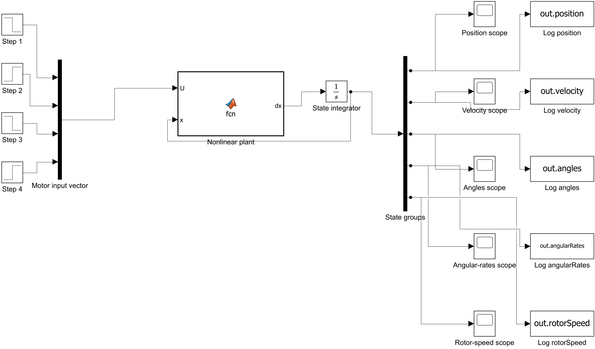
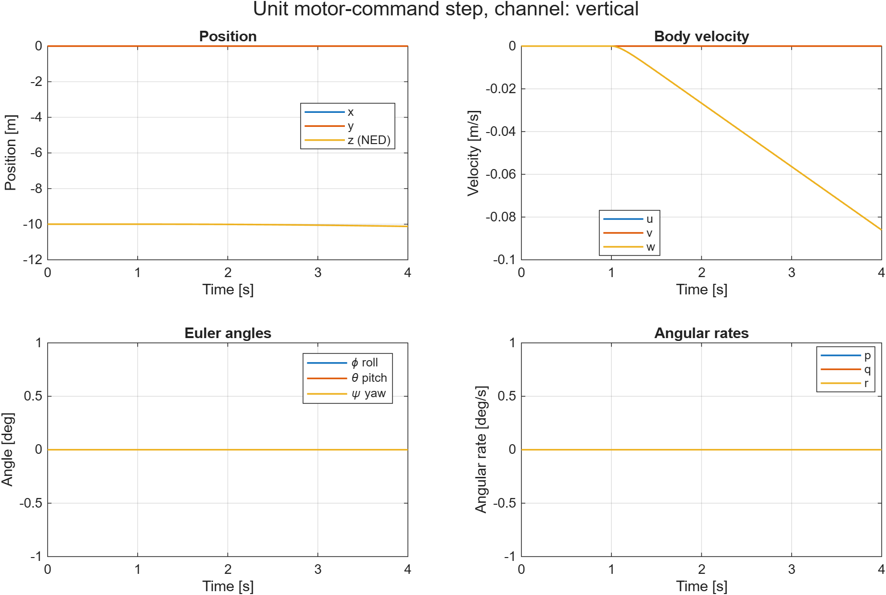
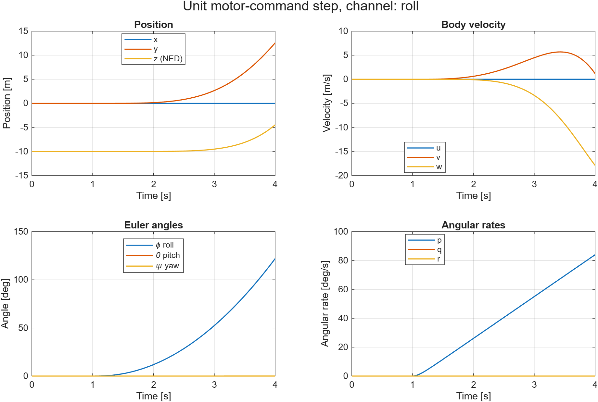
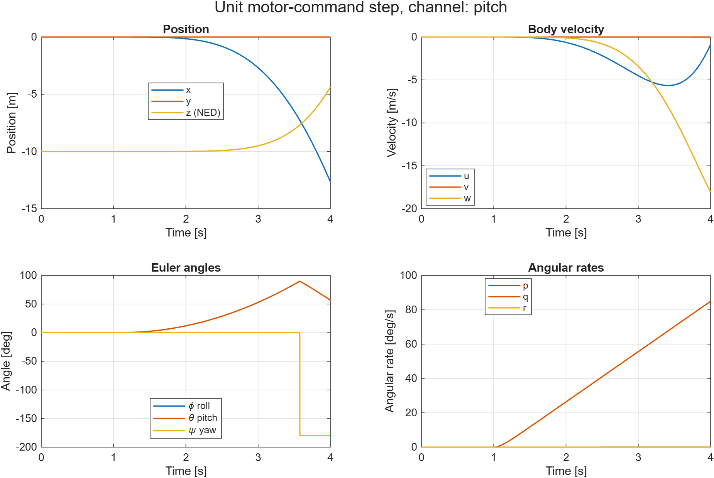
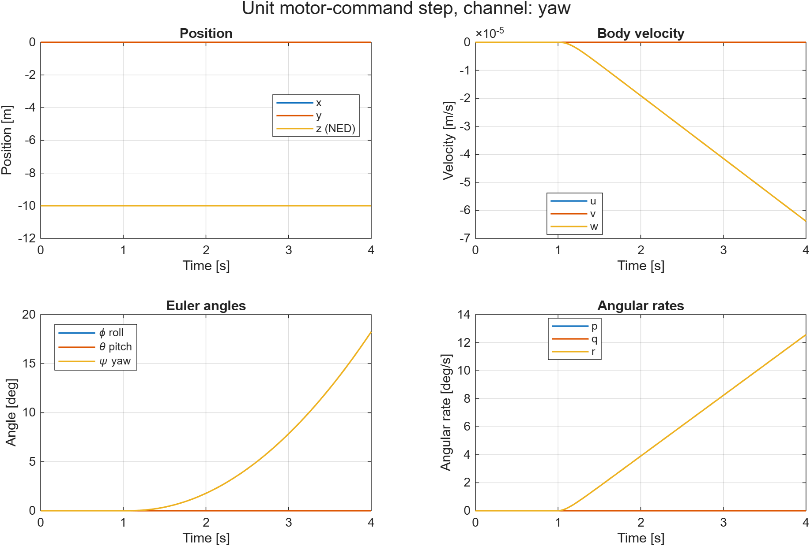

# Практичне завдання 1. Нелінійна модель квадрокоптера

**Дисципліна:** [назва дисципліни]  
**Виконали:** [Студент 1], [Студент 2]  
**Дата:** 22.07.2026

## Мета роботи

Проаналізувати магістерську роботу Томаша Їрінеца *Stabilization and control of unmanned quadcopter*, відтворити її нелінійну модель квадрокоптера в MATLAB/Simulink та дослідити реакцію моделі на одиничні ступінчасті збурення двигунів.

## 1. Аналітичний огляд

### 1.1. Суть роботи автора у 10 пунктах

1. Автор дослідив реальний квадрокоптер Linkquad, який міг літати під ручним керуванням, але не мав готової системи автономної стабілізації.
2. Літальний апарат описано як тверде тіло з шістьма ступенями вільності.
3. Виведено кінематичні рівняння для земної NED-системи координат і зв'язаної з корпусом системи.
4. Отримано нелінійні рівняння поступального та кутового руху.
5. До моделі додано гіроскопічні моменти гвинтів і динаміку двигунів постійного струму.
6. Ідентифіковано параметри апарата: тензор інерції, момент інерції гвинта, коефіцієнти тяги й аеродинамічного моменту.
7. Для вимірювання швидкості двигуна автор використав власний оптичний енкодер з Arduino.
8. На основі отриманих рівнянь створено нелінійну модель у Simulink.
9. Модель лінеаризовано біля точки висіння та поділено на вертикальний, креновий, тангажний і рискальний канали.
10. Для цих каналів розроблено каскадні регулятори та проведено моделювання й часткові випробування на реальному апараті.

### 1.2. Дорожня карта дослідження

1. Аналіз конструкції та можливостей Linkquad.
2. Вибір систем координат і виведення базових рівнянь руху.
3. Додавання гіроскопічних ефектів і моделі двигунів.
4. Ідентифікація масово-інерційних та аеродинамічних параметрів.
5. Побудова повної нелінійної моделі.
6. Лінеаризація біля режиму висіння та декомпозиція на чотири канали.
7. Синтез регуляторів і перевірка у симуляції.
8. Часткова перевірка на реальному квадрокоптері.

### 1.3. Концептуальний опис

Проблема полягала у тому, що наявний квадрокоптер не міг самостійно утримувати положення та орієнтацію. Мета автора — створити математичну основу й контури керування для автономного польоту. Для цього використано механіку твердого тіла, аеродинамічну ідентифікацію, моделювання у Simulink, лінеаризацію в точці висіння та каскадні регулятори.

## 2. Нелінійна модель у Simulink

### 2.1. Структура моделі

Модель має 16 станів: 12 станів руху твердого тіла та 4 швидкості обертання гвинтів. Чотири блоки **Step** формують збурення двигунів. Блок **Nonlinear plant** обчислює похідні станів, блок **State integrator** інтегрує їх у часі, а блоки **Scope** і **To Workspace** відображають та зберігають результати.

### 2.2. Використані рівняння

Сумарна тяга та моменти визначаються швидкостями гвинтів:

$$
T=b(\Omega_1^2+\Omega_2^2+\Omega_3^2+\Omega_4^2),
$$

$$
M_x=lb(\Omega_2^2-\Omega_4^2), \qquad
M_y=lb(\Omega_1^2-\Omega_3^2),
$$

$$
M_z=d(\Omega_2^2+\Omega_4^2-\Omega_1^2-\Omega_3^2).
$$

Поступальна динаміка реалізована у зв'язаній системі координат:

$$
\dot u=rv-qw-g\sin\theta,
$$

$$
\dot v=pw-ru+g\cos\theta\sin\phi,
$$

$$
\dot w=qu-pv+g\cos\phi\cos\theta-\frac{T}{m}.
$$

Для двигунів використано ідентифіковану ланку першого порядку:

$$
G_m(s)=\frac{0.7}{0.1s+1}.
$$

### 2.3. Конфігураційний файл і параметри

Файл `simulink/quadrotor_params.m` завантажує параметри моделі. Основні значення наведено нижче.

| Параметр | Значення |
|---|---:|
| Прискорення вільного падіння $g$ | $9.81$ м/с² |
| $I_x, I_y, I_z$ | $0.0093$, $0.0092$, $0.0151$ кг·м² |
| Момент інерції гвинта $I_p$ | $4.439\cdot10^{-5}$ кг·м² |
| Коефіцієнт тяги $b$ | $1.5108\cdot10^{-5}$ |
| Коефіцієнт моменту $d$ | $4.406\cdot10^{-7}$ |
| Швидкість висіння $\Omega_0$ | $463.1$ рад/с |
| Стала часу двигуна $\tau$ | $0.1$ с |
| Коефіцієнт двигуна $K$ | $0.7$ |

Маса обчислюється з умови висіння $mg=4b\Omega_0^2$ і становить приблизно $1.32$ кг. Довжину плеча $l=0.24$ м використано як інженерне припущення, оскільки точне значення для Linkquad не підтверджене у наданому тексті.

Усі швидкості гвинтів усередині моделі подані у рад/с. Обмеження $150$ об/с переведено у рад/с, щоб уникнути змішування одиниць.

## 3. Дослідження реакції на збурення

Для кожного тесту у момент $t=1$ с подається одиничний ступінчастий сигнал амплітудою 1. Тривалість симуляції — 4 с. Модель є відкритою: регулятори не підключені.

| Канал | Вектор збурення двигунів $[U_1,U_2,U_3,U_4]$ | Очікуваний основний відгук |
|---|---|---|
| Вертикальний | $[1,1,1,1]$ | Висота $z$ |
| Крен | $[0,1,0,-1]$ | Кут $\phi$ |
| Тангаж | $[1,0,-1,0]$ | Кут $\theta$ |
| Рискання | $[-1,1,-1,1]$ | Кут $\psi$ |

### 3.1. Вертикальний канал

Після $t=1$ с швидкість $w$ стає від'ємною, а координата $z$ трохи зменшується. У NED-системі від'ємна зміна $z$ означає набір висоти. Кути Ейлера та кутові швидкості залишаються нульовими, бо всі двигуни отримують однакове збурення.

### 3.2. Канал крену

Збурення різниці тяги двигунів 2 і 4 створює момент крену. Після $t=1$ с зростають кут $\phi$ та швидкість $p$. Унаслідок нахилу вектор тяги змінює напрямок, тому з'являються значні переміщення по $y$ і $z$. Без регулятора цей рух не стабілізується.

### 3.3. Канал тангажу

Збурення двигунів 1 і 3 формує момент тангажу. Зростають кут $\theta$ і кутова швидкість $q$, після чого з'являються переміщення вздовж $x$ та по висоті. При великих кутах наближення $\theta$ до $90^\circ$ призводить до особливості представлення кутів Ейлера; різкий стрибок $\psi$ на графіку є наслідком цього представлення, а не окремим керованим рисканням.

### 3.4. Канал рискання

Пари гвинтів, що обертаються у протилежні боки, створюють момент рискання. Після $t=1$ с зростають $\psi$ і $r$, тоді як $φ$ та $\theta$ залишаються близькими до нуля. Поступальний рух практично відсутній, що відповідає очікуваній декомпозиції каналу рискання.

## 4. Перевірка моделі та висновки

Автоматична перевірка виконала 9 тестів: рівновага у точці висіння, правильність мікшерів, запуск моделі та реакції всіх чотирьох каналів. Усі тести пройдено успішно.

Побудована нелінійна Simulink-модель відтворює основні частини структури з роботи: двигуни, тягу та моменти гвинтів, гіроскопічні ефекти, гравітацію, поступальний і кутовий рух. Результати підтверджують правильну реакцію вертикального, кренового, тангажного та рискального каналів на одиничні ступінчасті збурення.

Великі кути та переміщення у каналах крену й тангажу є очікуваними для об'єкта без зворотного зв'язку. Наступним кроком для повноцінної системи керування є лінеаризація біля точки висіння та підключення регуляторів.

## Вихідні матеріали

- `simulink/quadrotor_params.m` — параметри моделі.
- `simulink/quadrotor_nonlinear.slx` — Simulink-модель.
- `simulink/run_simulink_channel.m` — запуск окремих каналів.
- `simulink/tests/` — автоматичні перевірки.

## Джерело

Tomas Jirinec. *Stabilization and control of unmanned quadcopter*. Master's thesis, 2011. Надана українська версія роботи використана як допоміжний переклад.
